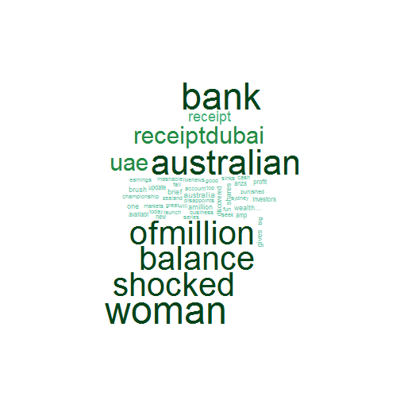

Word clouds for Big 4 Aussies banks, course project for DDP
========================================================
author: Alexander Levashov
date: 19 February 2015
transition: linear

General approach description
========================================================
type: sub-section
## Problem
Have you ever wondered what people think about financial institution?
## Solution
Build word clouds for each bank based on words popularity. The bigger the word in the cloud - the more often it is used in tweets associated with particular bank

Solution components
========================================================
My app allows to summorise the words people use when tweet about Big 4 Australian banks  
The whole solution has 3 parts:
* Getting data from Twitter (twitter_import.R script)
* Processed data (processing.R script)
* Presenting data to users as word clouds - Shyny app  

_Note that Shiny app doesn't pull data from Twitter in real-time, to make it fast it uses pre-processed data_

App highlights
========================================================
type: sub-section
* Side panel for controls - drop-down and sliders used
* Main panel to display resulting cloud 
* Reactive functions built to accomodate bank selection
* wordloud package to create clouds
 
Word cloud example (Westpac)
========================================================

 

App link:[https://alevashov.shinyapps.io/alex-course-project/](https://alevashov.shinyapps.io/alex-course-project/)  
Code at Github:[https://github.com/alevashov/my1stshinyapp](https://github.com/alevashov/my1stshinyapp)
